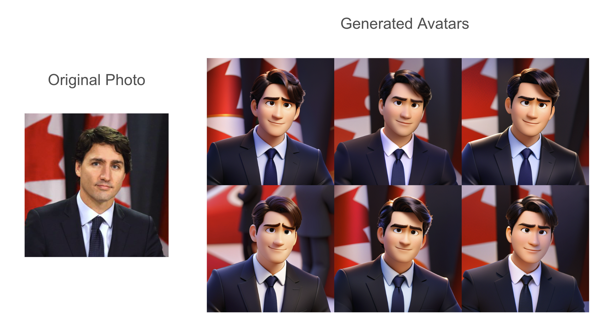

# PixarAvatar

PixarAvatar is a project that turns your portrait photos into Pixar characters.



## Features

- Given a portrain photo, the application will generate an avatar that resembles the person in the photo.
- Has the ability to analyze the input photos (using a VLM) to generate a more accurate avatar.

## Installation

1. Clone the repository:

    ```bash
    git clone https://github.com/ndvornik/PixarAvatar.git
    ```

2. Install the required dependencies:

    ```bash
    cd PixarAvatar
    
    # create a conda environment
    conda create -n pixaravatar python=3.9
    conda activate pixaravatar

    # install the required packages
    pip install -r requirements.txt
    ```

## Usage

1. To generate 4 different avatart (to chose from) from a given image, run the following command:

    ```bash
    python generate_avatar.py --image_url=<path_to_image> --output_dir=<output_directory> --num_avatars=4
    ```

    Tip: if the generation is slow (takes minutes), make sure you are using a GPU.

2. Parameters to the `generate_avatar.py` script are as follows:
    - `--image_url`: The path to the input image.
    - `--output_dir`: The directory where the generated avatars will be saved. Default is `./output`.
    - `--num_avatars`: The number of avatars to generate. Default is `1`.
    - `--crop`: The way the image will be cropped. Options are [`center`, `top`, `bottom` or `none`]. Default is `center`.
    - `--generate_prompt_from_image`: If `True`, the the image will be analyzed with a VLM to generate a more specific prompt for avatar generation. Usefull for generating more faithful avatars but slows down the process. Default is `False`.
    - `--device`: The device to run the model on. Options are [`cpu`, `cuda`]. If not set, the model will run on the device available.

## Notebook

The `pixar_avatar.ipynb` notebook contains the code to generate the avatar and visualize the results.
